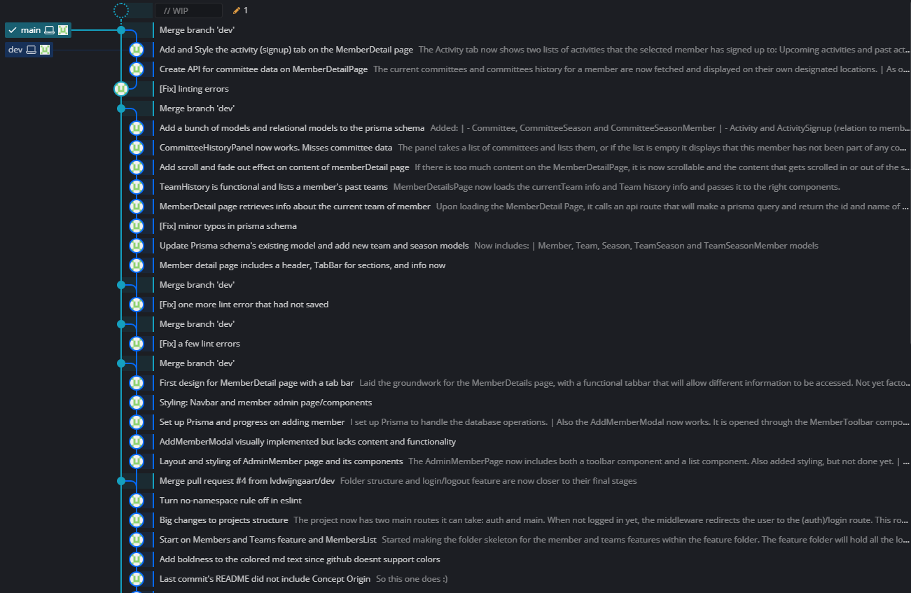
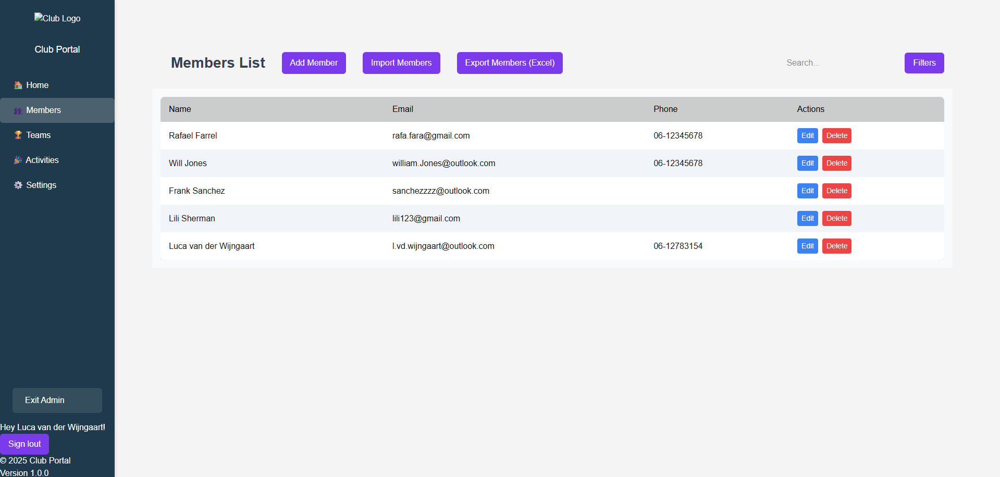
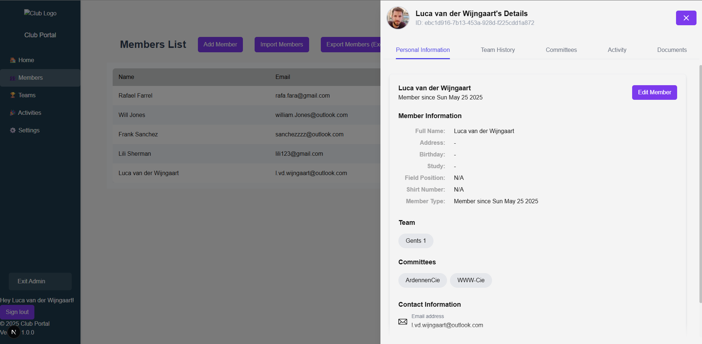

# Portal Project
Hey! My name is Luca van der Wijngaart and this application is being developed completely by me. __I'm building a (sports association) member portal.__ With this project I am looking to __hone my skills__ in 

- Programming languages/Frameworks: __React, Next.js and CSS__.
- System design: Devising system requirements, designing software and general documentation. 
- Other useful skills like: Best practices, __Git Management__ and deployment. 

All while hopefully building something my volleyball association could really use. Please read on to see the progress, features and current status of this project. If you have any questions or inquiries, please reach out to me via mail [l.vd.wijngaart@outlook.com](mailto:l.vd.wijngaart@outlook.com), or by messaging me on [LinkedIn](https://www.linkedin.com/in/luca-van-der-wijngaart-51046133a/?originalSubdomain=nl). 

  

# Progress: 
This project was started on May 21st, 2025. 

## 28th of May - 1 week post *init*

This first week was filled with enthousiasm and confidence, and looking back I think I achieved a lot. From setting up the git  to learning about deployments, building my first app using Next.js and learning about its routing. Here is a quick overview: 

- Maintained a neat and descriptive [git log](#Images). 
- Set up a postgres database, worked with Prisma and created datamodels for Members, Teams, Committees and Activities (and their relations). 
- Created the login (using NextAuth) and NavBar with temporary pages. 
- Lots of progress on the first page/feature: Member management
    - Member list
    - Add/Edit/Delete functionalities
    - Member details page including personal information, team/committee/activity-signup information
    - [Watch it in this demo!](https://drive.google.com/file/d/1qMg4q6C9pgKOL_BZiYvMBnqPHmeW-XBU/view?usp=sharing)

### Images

[Visit image](./public/git-log.png)

[Visit image](./public/member-page-list.png)

[Visit image](./public/member-page-detail.png)

  

# Concept Origin
This idea has been on my mind for a long time. At the start of 2024 I was made aware that my volleyball association was interested in having a member portal: A place where members can find all necessary information and are able to do all kinds of things (like sign up for activities, find information about committees and more) in one central location. 

### Wordpress 
In this time, I had been working with Wordpress for the associations website for a few years and being a Computer Science student, it inspired me to look at what was possible within Wordpress, specifically regarding making a member portal. Although a lot was possible and some open source plugins were available, I soon realized that I had to make a lot of changes within the public plugins' code I was using, and I even wrote 2 plugins from scratch __(HTML+CSS+JS+PHP)__. This turned out to be too time consuming and I was filled with too much doubt about the limitations of Wordpress, which is why, after some time, I let the project go. 

### ReactJS
At the start of 2025, I had started my bachelors degree's final project, in which we built an application for a real client, in a team of 11 students, within 9 weeks time. We worked with a __Python backend__, both __Firebase and PostgreSQL databases__ but the framework (technically 'library') __ReactJS__ specifically caught my attention. I was impressed with its simplicity but yet sleekness of the design we were able to build, while keeping the projects' folder structure clean and uncluttered. At this point I revisited my idea of making a member portal, but this time using ReactJS. 

### May 2025
Fast-forward only one month, May 2025, and I got stuck a little bit in my ReactJS project. My excitement to start coding had lead to me losing track of the software design techniques I had learned and the project had grown faster than I could keep up with. I was looking for a solution and was doubting if I should start over again, and that's when I found Next.js. I started reading about it, following the documentation tutorial and I couldn't let go of the idea of starting off fresh using Next.js, and doing it the right way. __And that is the git repository you are looking at now. In this project I really tried to put focus on taking the time to perform many and descriptive commits, writing Docs before starting to build features, and keep my folder structure as organized as I could, looking to follow best practices.__  

  

